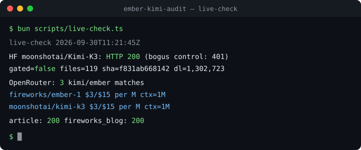

<p align="center">

[](https://github.com/toxicwind/ember-kimi-audit/actions/workflows/ci.yml)
[](docs/verdict.md)
[](docs/oddities.md)
[](LICENSE)

</p>

<h3 align="center">ember-kimi-audit</h3>

<p align="center">
  An independent, evidence-first audit of the <b>Ember-1 vs. Kimi K3</b> launch coverage —
  for anyone deciding whether to believe the headlines.
</p>

<p align="center">
  <a href="docs/verdict.md"><b>The verdict »</b></a> ·
  <a href="docs/oddities.md">Weirdness file</a> ·
  <a href="docs/confidence.md">Confidence ratios</a> ·
  <a href="docs/article-summary.md">Article summary</a>
</p>

<p align="center">
  <a href="https://github.com/toxicwind/ember-kimi-audit/issues/new?labels=bug&template=bug-report.yml">Report a wrong number</a> ·
  <a href="https://github.com/toxicwind/ember-kimi-audit/issues/new?labels=enhancement&template=feature-request.yml">Suggest a check</a>
</p>

<p align="center">
  
</p>

<details><summary><b>Table of Contents</b></summary>
<ol>
  <li><a href="#about-the-project">About the project</a></li>
  <li><a href="#the-10-second-verdict">The 10-second verdict</a></li>
  <li><a href="#claims-under-audit">Claims under audit</a></li>
  <li><a href="#the-weirdness">The weirdness</a></li>
  <li><a href="#confidence-ratios">Confidence ratios</a></li>
  <li><a href="#getting-started">Getting started</a></li>
  <li><a href="#usage">Usage</a></li>
  <li><a href="#project-structure">Project structure</a></li>
  <li><a href="#methodology">Methodology</a></li>
  <li><a href="#roadmap">Roadmap</a></li>
  <li><a href="#contributing">Contributing</a></li>
  <li><a href="#license">License</a></li>
  <li><a href="#acknowledgments">Acknowledgments</a></li>
</ol>
</details>

## About the project

On September 23, 2026, Fireworks AI launched **Ember-1** — billed as a faster,
cheaper derivative of Moonshot's open-weight **Kimi K3** that uses ~40% fewer
reasoning tokens. On September 29, The New Stack published the only
head-to-head benchmark in existence: 14/15 vs 15/15, 3.4× faster.

This repo audits every load-bearing claim in that coverage against **live
sources**: the Hugging Face Hub API, OpenRouter's live catalog, the article
itself, and public infrastructure records. Findings are dated, sourced, and
re-runnable — and when we got something wrong (we did, twice), the retractions
are in the docs, not the memory hole.

### Built with

- [Bun](https://bun.sh) — all scripts, zero dependencies
- [Hugging Face Hub API](https://huggingface.co/docs/hub/api) — weight availability checks
- [OpenRouter API](https://openrouter.ai/docs) — live pricing + throughput catalog
- [ProjectDiscovery](https://projectdiscovery.io) (`httpx`, `subfinder`, `katana`, `nuclei`) — infrastructure recon
- [Exa](https://exa.ai) — neural search for the deep-dive lanes

## The 10-second verdict

Fireworks' **Ember-1** is real — a Kimi K3 derivative that thinks shorter. It
does cut reasoning tokens (16–51% depending on workload), just not the clean
"40%" of the headline, and the "3.4× faster" was measured on Fireworks' own
endpoint — off Fireworks, Kimi K3's best provider is *faster*. The New Stack
article is disclosed, replicable launch coverage, not bought SEO. The genuinely
weird stuff is in the [oddities file](docs/oddities.md).

## Claims under audit

| # | Claim | Status | Detail |
|---|---|---|---|
| 1 | Ember-1 launched Sep 23 2026, research preview, built on Moonshot's open-weight Kimi K3 | ✅ Verified | [verdict](docs/verdict.md#reality-check-claim-by-claim) |
| 2 | ~40% fewer reasoning tokens | ⚠️ Partial | Fireworks' own table: 5.9%–51.9%; article measured 16–23% |
| 3 | 3.4× faster than Kimi K3 | ⚠️ Endpoint-only | Both models routed through Fireworks; OR data inverts it (73 vs 52 tok/s) |
| 4 | $3/$15 on OpenRouter; Kimi as low as $1/$9 elsewhere | ✅ Verified | Floor now lower: Sail Research $0.3654/$9.13 live |
| 5 | 14/15 vs 15/15 perfect runs | ✅ Internally consistent | Not independently reproducible without spend (~$6) |
| 6 | Free providers host Kimi K3 / Ember-1 | ⚠️ Split | Ember-1: nobody. Kimi K3: free tiers off-OR — ZenMux + aihubmix reachable Sep 30; TokenRouter/NaraRoute homepages not resolving (re-probed 2026-09-30) |
| 7 | "On-policy planning and learning" is a disclosed method | ⚠️ Demystified, still partial | It's GRPO-family async RL — Fireworks' own cookbook documents `GRPO/TIS/KL` and a literal "`0` is fully on-policy" knob — but Ember-1's exact reward recipe is undisclosed — [confidence #8](docs/confidence.md) |
| 8 | Bedside Bench relationship undisclosed | ❌ Mostly wrong | Doximity released it open (CC BY-NC-SA 4.0) Sep 22, *before* Ember-1 — [oddities #2](docs/oddities.md#2-bedside-bench--the-undeclared-relationship-critique-is-mostly-wrong) |
| 9 | Ember-1's commercial serving is covered by a Moonshot license agreement | ⚠️ Likely, unconfirmed | K3's license *requires* one for MaaS >$20M revenue; none disclosed — but Fireworks was Moonshot's day-0 K3 launch partner (Jul 27), so paper was probably signed in July — [oddities #14](docs/oddities.md#14-the-kimi-k3-license-gate--ember-1s-commercial-serving-may-require-a-moonshot-deal-nobody-has-disclosed) |

Full claim-by-claim: [`docs/verdict.md`](docs/verdict.md).

## The weirdness

Eighteen documented oddities — the short version:

- **The training phrase is now anchored.** "On-policy planning and learning" =
  Fireworks' GRPO-family async RL (their own cookbook documents the
  `max_head_offpolicy_versions` = 0 knob). But Ember-1's exact reward recipe —
  whatever makes reasoning *shorter* — is still undisclosed.
- **The 3.4× headline is endpoint-locked.** Off Fireworks, the speed ordering
  can invert.
- **Shorter reasoning *outperforms* longer traces** on Terminal Bench 2.1 and
  DeepSWE 1.1 — the cut loops were harmful, not just wasteful. The one finding
  that cuts *for* Ember-1 being genuinely different.
- **Zero Reddit footprint** for a 586-point HN launch. No independent
  Ember-1-vs-K3 benchmark exists anywhere — the TNS piece is the only
  head-to-head in existence.
- **Fireworks' entire GPU fleet is enumerable from public DNS** (381
  subdomains) — and Moonshot's API still negotiates TLS 1.0.
- **Oct 7 is a demand decision point, not a kill date.** Permanence is "based on
  community demand."
- **Per-token pricing rewards long thinking.** Only margin-absorbers want it
  short — Ember-1 is Fireworks monetizing its own margin, and the launch blog
  closes by pitching their Training platform.

All eighteen: [`docs/oddities.md`](docs/oddities.md).

## Confidence ratios

Speculation with numbers. Every load-bearing claim gets a quantified judgment —
P(claim is true) given all evidence — plus what would move it:

- Ember-1 is real and built on K3: **97%**
- "Built on" = real weight updates (not prompting): **55%**
- 3.4× is a model property: **25%**
- TNS article is bought SEO: **10%**
- Ember-1 is a marketing vehicle for Fireworks' Training platform: **70%**

All 23: [`docs/confidence.md`](docs/confidence.md). Anything under 60% is
"don't bet on it."

## Getting started

### Prerequisites

- [Bun](https://bun.sh) ≥ 1.0 — check with `bun --version`
- No API keys needed for the default lanes — the Hub API and OpenRouter catalog are public

### Quickstart

```bash
# 1. Clone
git clone https://github.com/toxicwind/ember-kimi-audit && cd ember-kimi-audit

# 2. Configure (optional — defaults work; see .env.example)
cp .env.example .env

# 3. Run the live audit
bun run live
```

You should see the Hub check, the OpenRouter catalog matches, and the article/blog
status — like the terminal screenshot at the top of this README.

## Usage

The three things you'll actually do:

```bash
bun run live          # one-command live audit (human-readable)
bun run live:json     # machine-readable — diff runs to spot drift
bun run snapshot      # save a dated snapshot to data/ (data/snapshot-YYYY-MM-DD.json)

bun run hf            # Hub API repo verification with bogus-ID control
bun run providers     # OpenRouter kimi/ember catalog snapshot

bun examples/verdict-summary.ts   # 10-second digest from the newest snapshot
```

The pd-mcp recon lane (ProjectDiscovery: subfinder, httpx, katana, nuclei)
runs from the bridge box — commands in [`.env.example`](.env.example).
Exa neural-search deep-dives are documented in the working notes.

## Project structure

```
ember-kimi-audit/
├── README.md                  # this file
├── assets/
│   └── live-check.svg         # terminal demo (above the fold)
├── docs/
│   ├── verdict.md             # the full verdict, claim by claim
│   ├── oddities.md            # 18 documented oddities (the weirdness file)
│   ├── confidence.md          # 23 confidence ratios — speculation with numbers
│   └── article-summary.md     # the TNS article's claims, distilled
├── scripts/
│   ├── live-check.ts          # one-command live audit (reads .env)
│   ├── hf-check.ts            # Hub API repo verification
│   └── providers.ts           # OpenRouter catalog snapshot
├── examples/
│   └── verdict-summary.ts     # 10-second digest from the newest snapshot
├── data/                      # dated raw evidence (API responses, snapshots)
├── .env.example               # live-config template (copy to .env)
├── .github/
│   ├── workflows/ci.yml       # CI: hygiene + weekly drift check
│   ├── ISSUE_TEMPLATE/        # bug report + feature request forms
│   └── PULL_REQUEST_TEMPLATE.md
├── CODE_OF_CONDUCT.md
├── SECURITY.md
├── CONTRIBUTING.md
├── hidden/                    # internal working notes — gitignored, not published
└── .gitignore
```

## Methodology

- **Live sources only.** Hub API `GET /api/models/<id>` (200 + siblings list)
  is evidence; a model card or forum post is a lead. Pricing comes from
  OpenRouter's live catalog, not screenshots.
- **Bogus-ID control.** From this network, deliberately fake Hub repo IDs also
  return 401 — so a bare 401 proves nothing. Every check runs a bogus control.
- **Four-witness absence protocol.** "Doesn't exist" is a verdict, not a shrug:
  skill catalog → bridge sweep → GitHub-wide → web. One empty search is not proof.
- **Dated evidence.** Every finding carries the source URL and observation date.
- **Speculation is labeled.** Confidence ratios in [`docs/confidence.md`](docs/confidence.md)
  are judgments, not measurements — and they say what would change them.

## Roadmap

- [x] Article-claims audit, HF verification, provider mapping
- [x] Community benchmarks + oddities (AI Benchy, HN, mills)
- [x] Site dig: thenewstack.io via pd-mcp (httpx/katana recon)
- [x] Author + publication deep-dive (Wachtel archive, TNS disclosure module)
- [x] Confidence ratios for all load-bearing claims
- [x] One-command live re-audit (`scripts/live-check.ts` + `.env`)
- [x] CI: scheduled `live-check --json` with drift alerts
- [x] Infra recon: fireworks.ai / moonshot.ai via pd-mcp (381 subdomains, TLS findings)
- [ ] Community chatter deep-dive: X/Twitter-native, new repros
- [ ] $6 replication of the TNS runs (moves 4 confidence ratios 20+ points)
- [ ] Ember-1 post-preview tracking: does it survive Oct 7?

## Contributing

Found a wrong number, a new benchmark, or a weirder oddity? Open an issue or
PR — evidence-first: link the live source and the date you observed it.
Corrections with sources get merged fast. Full guide: [CONTRIBUTING.md](CONTRIBUTING.md).

## License

Distributed under the MIT License. See [LICENSE](LICENSE) for details.
Upstream model weights belong to their publishers (Moonshot AI, Fireworks)
under their own licenses — this repo audits claims about them and ships no weights.

## Acknowledgments

- [AI Benchy](https://aibenchy.com) — the only independent scored benchmark of Ember-1 found
- [genztech.blog](https://genztech.blog) — independently verified the K3 baseline
- [temperaturezero](https://temperaturezero.com) — the sharpest HN critique synthesis
- [Samir Sengupta](https://www.samcodeman.com) — "no weights, no price" framing
- Jessica Wachtel / The New Stack — published full prompts, making this audit possible

---

<p align="center">If this saved you from believing a headline, give it a star. ⭐</p>
